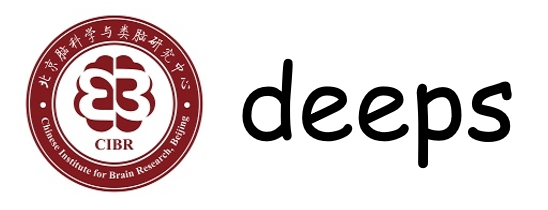
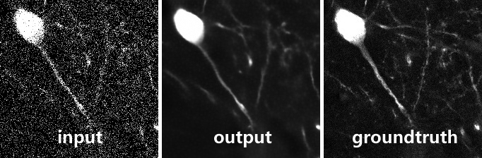
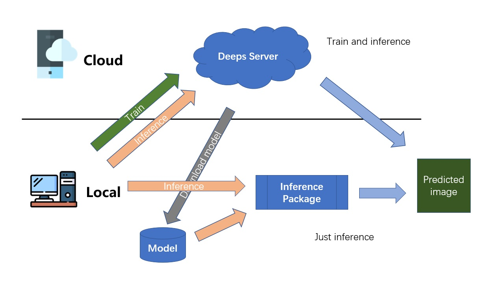

A deep learning framework for image processing with single pair of training images

---

In biological studies, there is a huge demand to recover high-quality images from low quality images. Basically, two typical steps are implemented to denoise and then deconvolute. Traditional methods have been developed to deal with different senarios separately. For us, it’s a reverse process either decreasing or increasing information of images. Here, we have proposed DeepS to fulfill the reverse functions with the same deep learning framework.

We provide two ways for you to process your datas, a [web server](http://deeps.cibr.ac.cn/) and a package([download](http://119.90.33.35:3557/sharing/wJWmfODpQ)) that can run in your computer.

### Useful Links

💜 Deeps homepage: http://deeps.cibr.ac.cn/

💜 Deeps inference package repository: https://github.com/azzhu/Deeps_Inference_Package

💜 Deeps server repository: https://github.com/azzhu/deeps

💜 CIBR homepage: http://www.cibr.ac.cn/