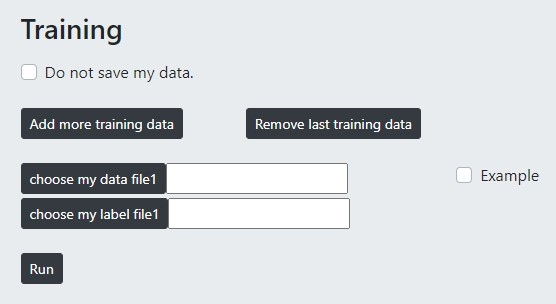
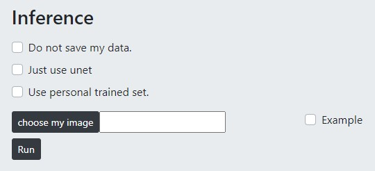

A deep learning framework for image processing with single pair of training images

---

该教程主要向您介绍deeps以及怎样使用deeps，包括怎样推理自己的数据、怎样训练自己的模型、怎样使用自己训练的模型推理新的数据、怎样下载预训练的模型以及自己训练的模型、怎样下载软件程序在自己本机上执行推理等等几个方面。

## Introduction

### Home

关于deeps的简介。

### Demo

Deeps demo结果展示。

### Super Resolution and Optical Section

该页面包含两个功能模块，Train（训练自己的数据）和Inference（推理自己的数据）。Train模块如下图所示：

- Do not save my data

一般情况下，为了增强我们的模型性能，我们希望您能共享您的数据，但如果您勾选了该选项，我们将尊重您的隐私，不会保存你的数据。

- Choose my data file and choose my label file

选择一对可供训练的图像数据。为了达到更好的训练效果，建议您上传分辨率更大的图像。我们支持的分辨率范围最小为512*512，最大为10000*10000。需要注意的是，该对训练数据必须严格对齐，如果训练数据没有对齐，那么训练将没有任何意义。

- Add more training data and remove last training data

默认情况下只可以选择一对训练数据，但是如果您想达到更好的实验效果，且您有更多的数据，则建议您通过该选项来管理（添加或者删除）更多的训练数据。

- Example

如果您没有自己的训练数据，但是想体验训练的过程，您可以勾选该选项，使用我们提供的示例训练数据。注意，使用该示例训练数据来训练模型并不会增加模型性能，因为该数据被包含在了当前预训练好的模型的训练集里。

- Run

点击该按钮，开始训练。为了解决模型在小样本情况下的训练问题，我们使用了迁移学习的方式，您的数据会在我们之前预训练好的模型的基础之上开始训练。

Inference 模块示意图如下：

- Do not save my data

如果您不希望我们保留您的数据，请您勾选该选项。
- Just use unet

我们使用了两种模型结构，deeps和unet，这两种结构训练出的模型分别有自己的特点。以我们的经验，我们建议您使用deeps（也就是不勾选该选项），如果deeps达不到您的期望，您也可以尝试unet的结果，good luck。
- Use personal trained set

如果您在上一步使用自己的数据训练了新的模型，这里您可以勾选该选项，来查看自己训练的模型的效果。如果不勾选该选项，则使用默认的模型（即我们预训练的模型）来进行推理。

- Choose my image

选择自己的数据，如果勾选后面的example，则会使用示例数据。

- Run

开始执行推理，请等待。

## What do you want to do?

### 使用预训练的模型推理自己的数据

1. 主页
2. 点击SR or OS
3. 选择inference
4. 点击choose my image
5. 点击run

### 自己有标记好的数据，想训练自己的模型

1. 主页
2. 点击SR or OS
3. 选择train
4. Choose my data file，choose my label file
5. Run

### 使用刚刚自己训练好的模型推理新的数据

1. 选择inference
2. 勾选Use personal trained set
3. 点击choose my image
5. 点击run

### 下载模型

等训练完成后会有下载链接，点击即可下载

### 使用下载的模型在自己本机上运行

参见https://github.com/azzhu/Deeps_Inference_Package/blob/master/README.md

## Useful Links

💜 Deeps homepage: http://deeps.cibr.ac.cn/

💜 Deeps documentation: https://github.com/azzhu/deeps/blob/master/SERVER/webserver_doc.md

💜 Deeps repository: https://github.com/azzhu/deeps

💜 Deeps inference package repository: https://github.com/azzhu/Deeps_Inference_Package

💜 CIBR homepage: http://www.cibr.ac.cn/